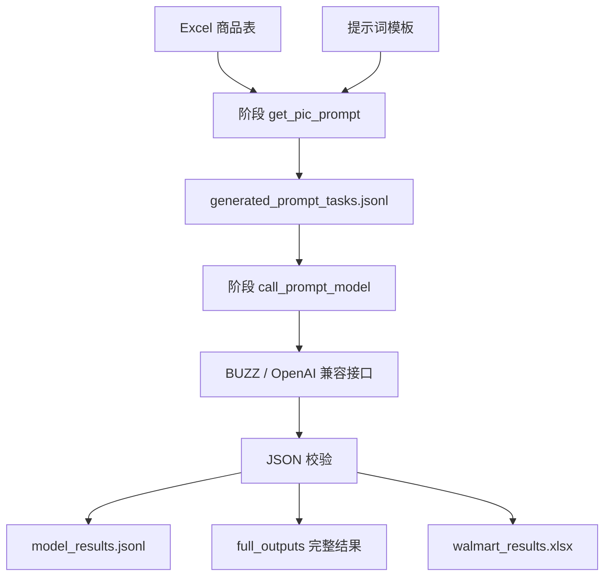

# 项目架构说明

## 设计目标

本项目不是为单个脚本服务，而是作为可扩展的 AI 中转站调用框架。核心目标：

- 兼容多个中转站。
- 支持多个模型。
- 支持 Excel 或数据库输入。
- 支持批量处理、日志、失败重试。
- 支持每个任务独立结果校验。
- 支持业务任务按阶段衔接。

## 分层结构

```text
E:\WorkSpace\ai_gateway
  configs/                      全局基础配置
  docs/                         项目文档
  src/ai_gateway/               通用代码
    clients/                    API 客户端
    config/                     配置加载
    gateways/                   中转站配置与适配
    validators/                 JSON 与模板结果校验
    subtasks/                   可复用阶段代码模块
  subtasks/                     业务任务目录
    walmart_image_prompt/       当前 Walmart 图片提示词业务任务
      00_full_workflow.py
      01_generate_prompt_tasks.py
      02_call_buzz_model.py
      03_generate_and_download_images.py
      workflow_common.py
      stages/
        get_pic_prompt/
        call_prompt_model/
```

## 业务任务与代码模块的区别

`subtasks/walmart_image_prompt/` 是业务任务目录，负责保存该业务自己的配置、启动脚本、阶段说明和输出文件。

`src/ai_gateway/subtasks/*.py` 是可复用代码模块，负责实现某类阶段能力，例如 Excel 生成提示词、调用模型、写回 Excel。后续新业务任务可以复用这些模块，也可以新增模块。

## 当前业务链路



## 配置原则

每个业务任务下，每个阶段都有自己的 `config.json`。

阶段配置中应明确：

- 输入文件或输入数据库。
- 输出文件或输出数据库。
- 使用哪个中转站。
- 使用哪个模型。
- 是否开启 stream。
- 最大处理条数。
- 校验规则。
- 重试规则。

全局 `configs/gateways.yaml` 和 `configs/models.yaml` 只保存通用基础配置；业务运行以阶段配置为准。

## 扩展方式

新增业务任务时：

1. 在 `subtasks/` 下新增一个业务任务目录。
2. 在业务任务目录里写清楚编号入口：`00_full_workflow.py`、`01_<step>.py`、`02_<step>.py`、`03_<step>.py`。
3. 总流程入口只负责串联阶段，是否执行某阶段由业务根配置里的 `workflow` 控制。
4. 每个处理阶段放到 `stages/<stage_name>/`。
5. 每个阶段有自己的 `config.json`、`README.md`、`output/`。
6. 能复用的处理逻辑放到 `src/ai_gateway/`。
7. 不要把业务启动脚本放在项目根目录。


