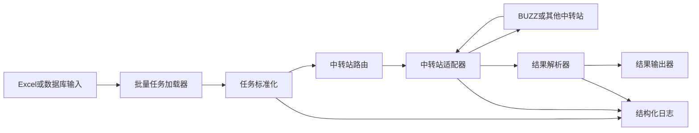

# AI Gateway 多中转站调用系统设计文档

## 1. 目标

建设一个统一的 AI API 调用系统，用同一套调用、日志、批处理、错误处理和配置机制，兼容多个中转站。当前第一期接入 BUZZ，后续可继续接入其他 Claude/OpenAI/Gemini 兼容中转站或官方 API。

系统重点：

- 统一调用入口：业务代码不直接依赖某个中转站。
- 多中转站兼容：通过适配器接入不同 base_url、鉴权方式、模型名和请求格式。
- 支持文本、图片 URL + 文本、base64 图片 + 文本等多模态输入。
- 支持批量处理：入参可来自数据库，也可来自 Excel 表格。
- 有调用日志：记录请求批次、单条任务、耗时、模型、状态、错误摘要和结果位置。
- 易扩展：新增中转站时只增加配置和适配器，不改业务主流程。

## 2. 推荐目录结构

```text
E:\WorkSpace\ai_gateway
  docs/
    system_design.md
  gateways/
    BUZZ/
      README.md
  src/
    ai_gateway/
      config/
      adapters/
      clients/
      jobs/
      inputs/
      outputs/
      logging/
  configs/
    gateways.yaml
    models.yaml
  examples/
    excel_batch_template.xlsx
  logs/
  data/
```

当前先建立文档目录，代码目录可在实现阶段创建。

## 3. 总体架构



核心分层：

- 输入层：读取 Excel 或数据库记录，转成统一任务对象。
- 任务层：校验入参、补默认模型、构造 prompt、多图片处理。
- 中转站层：根据配置选择中转站，完成鉴权、请求转换、重试和响应解析。
- 校验层：对模型返回进行 JSON 解析和模板校验，保留原始回答并记录校验结果。
- 输出层：结果写回数据库、导出 Excel/CSV/JSONL，或保存到本地文件。
- 日志层：记录批次日志、任务日志、错误日志、原始响应摘要。

## 4. 统一任务模型

建议内部统一为 `AiTask`：

```json
{
  "task_id": "row-000001",
  "gateway": "buzz",
  "model": "gpt-5.6-luna",
  "input_type": "image_text",
  "prompt": "请识别图片中的商品信息",
  "images": [
    {
      "type": "url",
      "value": "https://example.com/a.jpg"
    }
  ],
  "response_template": {
    "type": "object",
    "required": ["title", "brand"],
    "properties": {
      "title": {"type": "string"},
      "brand": {"type": "string"}
    }
  },
  "metadata": {
    "source": "excel",
    "row_number": 2,
    "sku": "ABC001"
  }
}
```

文本任务、图片 URL 任务、base64 图片任务都转换成这个结构。

## 5. 中转站适配器设计

每个中转站实现同一接口：

```python
class GatewayAdapter:
    name: str

    def build_request(self, task):
        pass

    def send(self, request):
        pass

    def parse_response(self, response):
        pass

    def normalize_error(self, error):
        pass
```

适配器负责：

- base_url 和 endpoint。
- 鉴权 Header。
- 模型名映射。
- 图片 URL/base64 转换规则。
- 响应文本抽取。
- 错误码标准化。

业务批处理逻辑只调用统一接口，不关心底层是 BUZZ 还是其他中转站。

## 6. 配置设计

示例 `configs/gateways.yaml`：

```yaml
default_gateway: buzz

gateways:
  buzz:
    type: anthropic_compatible
    base_url: https://buzzai.cc
    api_key_env: BUZZ_API_KEY
    auth_header: x-api-key
    timeout_seconds: 120
    max_retries: 3
```

示例 `configs/models.yaml`：

```yaml
default_model: gpt-5.6-luna

models:
  gpt-5.6-luna:
    gateway: buzz
    provider: openai
    api_style: chat_completions
    cost_tier: cheapest
    context_window: short
    max_context_tokens: 272000
    supports_text: true
    supports_image_url: true
    supports_image_base64: true
    max_tokens_default: 4096
    temperature_default: 0.2
    image_detail: auto
```

## 7. 批量处理设计

### 7.1 Excel 输入

推荐列：

| task_id | model | prompt | image_url | image_url_2 | output_format | extra_json |
| --- | --- | --- | --- | --- | --- | --- |
| 1 | gpt-5.6-luna | 识别商品信息 | https://...jpg | | json | {} |

处理流程：

1. 读取 Excel。
2. 每行转换为 `AiTask`。
3. 校验 prompt、图片 URL、模型能力。
4. 并发调用 API。
5. 结果写入新 Excel 或数据库。

### 7.2 数据库输入

建议任务表：

```sql
CREATE TABLE ai_gateway_tasks (
  id BIGINT PRIMARY KEY,
  batch_id VARCHAR(64),
  gateway VARCHAR(64),
  model VARCHAR(128),
  prompt TEXT,
  input_payload JSON,
  status VARCHAR(32),
  result_text TEXT,
  parsed_json JSON,
  validation_status VARCHAR(32),
  validation_errors JSON,
  retryable BOOLEAN,
  retry_count INT,
  max_retries INT,
  error_code VARCHAR(128),
  error_message TEXT,
  last_attempt_at DATETIME,
  next_retry_at DATETIME,
  created_at DATETIME,
  updated_at DATETIME
);
```

可按 `status = 'pending'` 拉取任务，处理后更新为 `success` 或 `failed`。

## 8. 日志设计

日志不用太长，但必须能定位问题。

### 8.1 批次日志

记录字段：

- batch_id
- source_type: excel/database
- total_count
- success_count
- failed_count
- started_at
- finished_at
- output_path

### 8.2 单任务日志

记录字段：

- task_id
- batch_id
- gateway
- model
- input_type
- request_id，如中转站返回
- status
- latency_ms
- retry_count
- error_code
- error_message_short

建议输出 JSONL：

```json
{"batch_id":"b20260805","task_id":"1","gateway":"buzz","model":"gpt-5.6-luna","status":"success","latency_ms":1800}
```

## 9. 错误处理与重试

建议错误分层：

- AuthError：Key 错误、权限不足。
- RateLimitError：限流，可重试。
- TimeoutError：超时，可重试。
- GatewayUnavailableError：中转站不可用，可重试或切备用中转站。
- ModelNotFoundError：模型不可用，不建议重试。
- BadInputError：图片 URL 无法访问、格式不支持、prompt 缺失，不建议重试。

重试策略：

- 默认最多 3 次。
- 指数退避：1s、3s、8s。
- 只对 429、5xx、网络超时重试。
- 认证、参数错误、模型不存在直接失败。

## 9.1 批次失败记录重试

当一批 100 条任务执行后，如果 90 条成功、10 条失败，系统应保留这 10 条失败记录，并支持按批次直接重试，不要求人工修改数据库状态。

推荐命令形态：

```bash
python -m ai_gateway retry --batch-id B20260805 --concurrency 3
```

内部流程：

1. 查询 `batch_id = B20260805` 的失败记录。
2. 只选择 `retryable = 1` 且 `retry_count < max_retries` 的任务。
3. 将任务标记为 `running`。
4. 调用对应中转站。
5. 成功则更新为 `success`。
6. 失败则更新错误信息、`retry_count`、`last_attempt_at` 和 `retryable`。
7. 日志追加新 attempt，不覆盖旧日志。

推荐查询：

```sql
SELECT *
FROM ai_gateway_tasks
WHERE batch_id = :batch_id
  AND status = 'failed'
  AND retryable = 1
  AND retry_count < max_retries
ORDER BY updated_at
LIMIT :limit;
```

是否可重试由系统根据错误类型判断：

- 可重试：429、timeout、网络临时异常、5xx。
- 不重试：401、403、模型不存在、参数错误、图片格式错误。

## 10. 并发与限速

批量处理建议参数化：

- `concurrency`: 默认 3-5。
- `requests_per_minute`: 按中转站限制配置。
- `max_retries`: 默认 3。
- `timeout_seconds`: 默认 120。

同一个系统可以为不同网关设置不同限速。

## 11. 输出设计

Excel 批处理输出建议新增列：

- status
- result_text
- validation_status
- validation_errors
- parsed_json
- error_code
- error_message
- gateway
- model
- latency_ms
- processed_at

数据库批处理则写回任务表，或者写入单独结果表。

### 11.2 OSS 上传输出

图片生成后的 OSS 上传应作为独立业务阶段处理。平台级 OSS 配置放环境变量或 `configs/local.env`，业务上传范围和 OSS key 规则来自业务任务配置与批次目录。

推荐输出：

```text
batches/<批次名>/05_upload_oss/
  oss_upload_checkpoint.jsonl
  oss_upload_results.jsonl
  walmart_sub_image_oss_result.xlsx
```

每张图片独立记录：

- SKU
- 图片命名
- 本地路径
- OSS object key
- OSS URL
- 上传状态
- 错误摘要
- 上传时间

详见 `docs/oss_upload_design.md`。

### 11.1 结果校验设计

默认建议让模型返回 JSON。每个任务可以携带 `response_template`，系统在 API 调用成功后执行校验。

校验原则：

- 原始返回永远保存在 `result_text`。
- 校验成功写入 `validation_status = passed`。
- 校验失败写入 `validation_status = failed` 和 `validation_errors`。
- 如果未配置模板，写入 `validation_status = not_checked`。
- API 调用失败时不做结果校验。

第一阶段内置轻量模板校验，支持：

- `type`: object、array、string、number、integer、boolean。
- `required`: 必填字段。
- `properties`: 对象字段类型。
- `items`: 数组元素类型。

示例：

```json
{
  "type": "object",
  "required": ["title", "brand", "confidence"],
  "properties": {
    "title": {"type": "string"},
    "brand": {"type": "string"},
    "confidence": {"type": "number"}
  }
}
```

## 12. 后续实现步骤

1. 建立 Python 项目骨架。
2. 实现配置加载。
3. 实现 BUZZ 适配器。
4. 实现 Excel 输入/输出。
5. 实现数据库任务读取/写回。
6. 实现批处理调度、并发、重试和日志。
7. 增加一个命令行入口，例如：

```bash
python -m ai_gateway batch --input tasks.xlsx --gateway buzz --output result.xlsx
```

## 13. 第一阶段范围建议

第一阶段先做：

- BUZZ 中转站。
- Excel 批量输入。
- 图片 URL + 文本识别。
- JSONL 日志。
- 结果导出 Excel。

数据库接入作为第二阶段，但接口和任务模型提前设计好。

